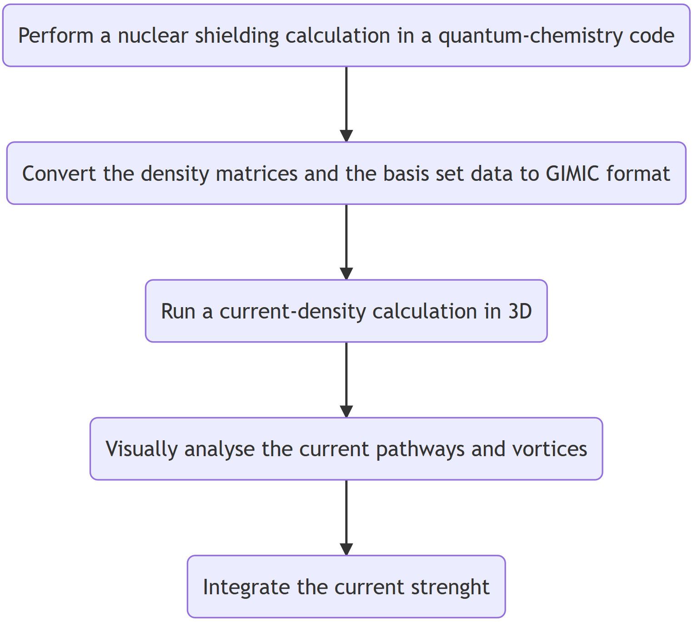
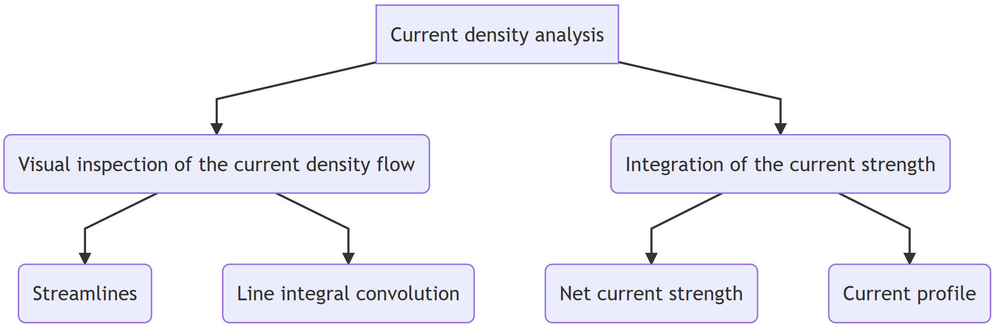

GIMIC Quick-start Guide
===============================

In order to perform your first GIMIC calculation, you need to obtain the
unperturbed and the magnetically perturbed density matrices in a quantum
chemistry program. Refer to https://gimic.readthedocs.io/en/latest/usage.html
for more details.  Assuming that the ``XDENS`` and ``MOL`` files containing the
density matrices and the basis set data respectively are available, you can
start the current density analysis. 

Current density analysis should be done both visually and quantitatively. Start
by doing a visual analysis of the current density field. After choosing the
current pathways of interest, you can perform integrations of the current
strength. 

Visual analysis 
---------------------

A cubical 3D grid is defined around the molecule such that the box extends
about 8 bohr away from the atoms in the plane perpendicular to the magnetic
field, and about 4 bohr above and below the molecule. A quick way of generating
the input file is to employ the script ``3D-run.sh``. Refer to
https://gimic.readthedocs.io/en/latest/scripts.html for more information on
setting up the script. It prepares the input file ``gimic.inp`` and calculates
the suitable position of the box such that the whole molecule is embedded in
the box. The file is found in the newly created directory called ``3D``. Unless
there are any further adjustments needed, such as only analysing some part of a
big molecule, the calculation can be started immediately. Remember to specify
the number of threads in your SLURM job script as

:: 

    export OMP_NUM_THREADS=$SLURM_NPROCS

When the calculation has finished, the current density is written to the
``jvec.vti`` file. It can be visualised in Paraview according to the
instructions at 
https://gimic.readthedocs.io/en/latest/scripts.html
https://gimic.readthedocs.io/en/latest/interpretation.html

Integration of the current strength
---------------------------------------

The next step: interactively set up calculations of the current profile. 
https://gimic.readthedocs.io/en/latest/scripts.html
https://gimic.readthedocs.io/en/latest/interpretation.html

There are several general keyword related to the type of the calculation (the
``calc`` keyword), 

**Problem 1.** I would like to calculate the current profile for the benzene
molecule passing the bond between two carbon atoms. 

I will employ the bond type grid. I have to specify the indices of the atoms
through which the plane will cross. They are specified by the keyword
``bond=[a1,a2]`` where a1 and a2 are the indices of the atoms according to the
XYZ file. NOTE: that the counting starts from 1. 

Any plane is defined by three points. Two of them are the atomic coordinates.
The third point will define one of the infinitely many points which pass
through the chemical bond. A physically meaningful choice is to specify the
plane which is perpendicular to the benzene ring. We call this point
``fixpoint``. For a visual representation of the mathematical definition of 
the fixed point and how the basis vectors for the integration plane are 
calculated, check out https://youtu.be/m0rL3j0dUYw.

Typically, the plane is placed such that it passes through the midpoint of the
chemical bond. This is defined through the ``distance`` keyword. With this the
integration plane is fully specified. 

However, we cannot perform calculations on an infinitely big integration plane.
We need to choose a rectangle on the plane such that the current density
vanishes from all sides. We call ``height`` the distance above and below the
molecule. This is the side of the rectangle perpendicular to the benzene ring.
The other side of the rectangle is parallel to the molecular ring. It is called
``width``.

In the minimal example, we also need to provide the ``spacing`` between the
grid points on the integration plane. Three numbers are required, one for each
spatial dimension. The numberical integration is performed using Gauss
quadrature. This is specified with the keyword ``type=gauss``. The order of the
Gauss quadrature is given as ``gauss_order=9``. 

A minimal example for the definition of a bond grid:

:: 

    Grid(bond) {                    # define grid orthogonal to a bond 
        bond=[1,2]                  # the two atoms
        fixpoint=4                  # the third point defining the plane
        distance=1.32               # place grid 'distance' between atoms
        
        type=gauss                  # gauss distribution of grid points for the integration
        gauss_order=9               # order for gauss quadrature
        
        height=[-5.0, 5.0]
        width=[-2.2, 5.0]
        
        spacing=[0.02, 0.02, 0.02]     # spacing of points on grid (i,j,k)
    }

